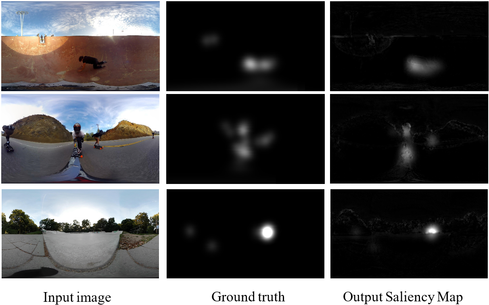

# Saliency Prediction for 360-Degree Video


## Table of Contents
- [Introduction](#introduction)
- [Project Overview](#project-overview)
- [Installation](#installation)
- [Usage](#usage)
- [Configuration](#configuration)
- [Dataset](#dataset)
- [Results](#results)
- [Inspiration](#inspiration)
- [Acknowledgement](#acknowledgement)
- [To Do](#to-do)
- [License](#license)
- [Citation](#citation)

## Introduction

This repo contains the codes that are used in the paper **"Saliency prediction for 360-degree video"** published in [GTSD2020](https://ieeexplore.ieee.org/document/9303135). This work is also part of the Capstone project of student **Vo Hoang Chuong** from **the University of Science and Technology - The University of Danang**.

## Project Overview

In this work, we proposed a novel spherical convolutional network concentrating on 360° video saliency prediction. The kernel is defined as a spherical cap, and the convolutional patches preserve the spherical perspective.

## Installation

### Prerequisites
- Python 3.6
- [CUDA toolkit 10.2](https://developer.nvidia.com/cuda-10.2-download-archive)
- [CuDnn 7.6.5](https://developer.nvidia.com/rdp/cudnn-archive)

### Steps
1. Clone the repository:
    ```sh
    git clone https://github.com/vhchuong/Saliency-prediction-for-360-degree-video.git
    ```
2. Navigate to the project directory:
    ```sh
    cd Saliency-prediction-for-360-degree-video
    ```
3. Install the required Python packages:
    ```sh
    pip install -r requirements.txt
    ```

## Usage

### Testing
To reproduce the results, run:
```sh
python Testing_model.py
```
Visualize the output with [visdom](https://github.com/facebookresearch/visdom):
```sh
visdom
```
Navigate to `http://localhost:8097/` and choose env `test1`.

### Training
To retrain the model, run:
```sh
python train.py
```
For visualization, follow the steps for visdom and choose env `final`.

## Configuration

Modules used in this project:
- pytorch: 1.5.0
- CUDA toolkit: 10.2
- CuDnn: 7.6.5
- Numpy: 1.17.4
- torchvision: 0.6.0
- Pillow: 7.0.0
- visdom: 0.1.8.9

## Dataset

The dataset we utilized is from the paper "Saliency Detection in 360° Videos" by **Ziheng Zhang, Yanyu Xu**, Jingyi Yu, and Shenghua Gao. The original download link is provided on [\[Baidu Pan\]](https://pan.baidu.com/share/init?surl=akj0-8obIwC9oykTYSUm9Q) with the passcode `ry6u`. However, downloading the dataset at full speed requires a premium Baidu NetDisk account, which can be time-consuming. For easier access, we have reuploaded it to [\[TeraBox\]](https://terabox.com/s/1nmn4Pb_wmceMmO7QHSiB9Q) with the password `4p8t`. The dataset includes 12 zip files and a train/test index. Once downloaded, unzip these files together and place the unzipped folders along with the 'vinfo.pkl' file into a single folder named '360_Saliency_dataset_2018ECCV'.

## Results



## Inspiration

Inspired by the work of [Ziheng Zhang, Yanyu Xu](https://github.com/xuyanyu-shh/Saliency-detection-in-360-video).

## Acknowledgement

Gratitude to [**Assoc. Prof. Jui-Chiu Chiang**](https://ieeexplore.ieee.org/author/37416120400) for guidance and supervision, and special thanks to [**Mr. Ziheng Zhang**](https://scholar.google.com/citations?user=QQ2-OOUAAAAJ&hl=en) for assistance. Extremely thanks to the [**Pytorch**](https://discuss.pytorch.org/) community for the precious information!

## To Do

- [ ] Release the code for generating the coordinates of the surrounding pixels corresponding to each center pixel in panorama format
- [ ] Implement generic custom spherical convolution for any input size

## License

This work is released under the MIT License.

## Citation

If you find this work helpful, please consider citing:
```
@INPROCEEDINGS{9303135,
  author={C. H. {Vo} and J. -C. {Chiang} and D. H. {Le} and T. T. A. {Nguyen} and T. V. {Pham}},
  booktitle={2020 5th International Conference on Green Technology and Sustainable Development (GTSD)}, 
  title={Saliency Prediction for 360-degree Video}, 
  year={2020},
  volume={},
  number={},
  pages={442-448},
  doi={10.1109/GTSD50082.2020.9303135}}
```
